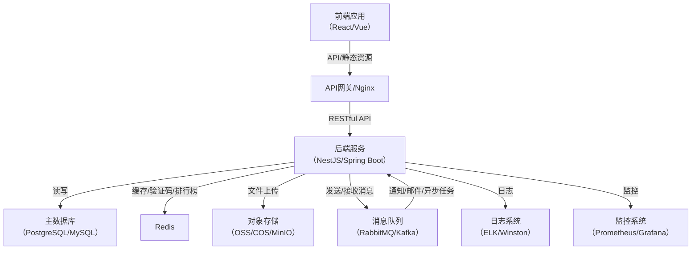

# 博客系统架构设计

```mermaid
graph TD
  A[前端应用<br>（React/Vue）] -- API/静态资源 --> B[API网关/Nginx]
  B -- RESTful API --> C[后端服务<br>（NestJS/Spring Boot）]
  C -- 读写 --> D[主数据库<br>（PostgreSQL/MySQL）]
  C -- 缓存/验证码/排行榜 --> E[Redis]
  C -- 文件上传 --> F[对象存储<br>（OSS/COS/MinIO）]
  C -- 发送/接收消息 --> G[消息队列<br>（RabbitMQ/Kafka）]
  C -- 日志 --> H[日志系统<br>（ELK/Winston）]
  C -- 监控 --> I[监控系统<br>（Prometheus/Grafana）]
  G -- 通知/邮件/异步任务 --> C
```

- 前端通过API网关与后端服务交互，静态资源可由CDN加速。
- 后端服务负责业务逻辑、鉴权、数据处理。
- 数据库存储核心业务数据，Redis用于缓存和高频数据。
- 消息队列处理异步任务和通知。
- 对象存储用于图片、附件等非结构化数据。
- 日志和监控保障系统稳定运行。
